# Learning Domain-Driven Design  
### _A Practical Summary Inspired by Vlad Khononov_  

This repository provides a concise, practical summary of the main concepts from **“Learning Domain-Driven Design”** by Vlad Khononov.  
It is structured to be easy to read, use, and reference during real-world software design.

> ⚠️ **Note:** This is *not* a replacement for the book — it’s a simplified reference for practitioners.

---

# Table of Contents
1. [Business Domain](#business-domain)  
2. [Subdomains](#subdomains)  
3. [Extracting Domains](#extracting-domains)  
4. [Knowledge Flow](#flow-of-domain-knowledge)  
5. [Ubiquitous Language](#ubiquitous-language)  
6. [Bounded Context](#bounded-context)  
7. [Context Relationships](#bounded-context-relationships)  
8. [Aggregates & Tactical Patterns](#aggregate-root)  
9. [Design Patterns](#tactical-patterns)  
10. [Architectural Styles](#architectural-patterns)  
11. [Event Storming](#eventstorming)  
12. [Migration Patterns](#strangler-pattern)  
13. [Microservices & Bounded Contexts](#bounded-context-and-microservice)  
14. [Microservices, Complexity & Event-Driven Architecture](#microservices-complexity--event-driven-architecture)  
15. [Event-Driven Concepts](#event-and-messages-and-command)  
16. [Analytical Data & Data Mesh](#data-mesh--domain-driven-analytical-modeling)

---

# Business Domain
The **business domain** is the core business of the company — the purpose it exists.

Examples:
- Amazon → Retail & logistics  
- Uber → Ride-hailing  
- FedEx → Delivery  

---

# Subdomains
Each domain is split into **subdomains**, and companies cannot succeed with only one.

| Type | Description | Notes |
|------|-------------|-------|
| **Core** | Provides competitive advantage | Must be unique |
| **Supporting** | Needed but not strategically unique | Could be externalized |
| **Generic** | Commodity functionalities | Often OSS/SaaS |
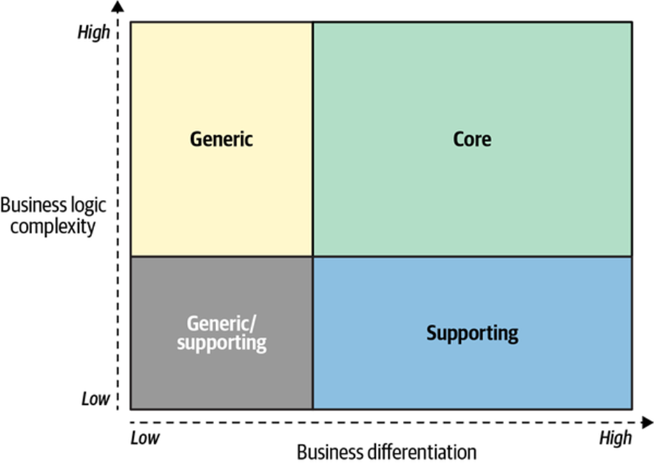
> If a supporting domain becomes revenue-generating → it becomes **Core**.

---

# Extracting Domains (Example Through Departments)

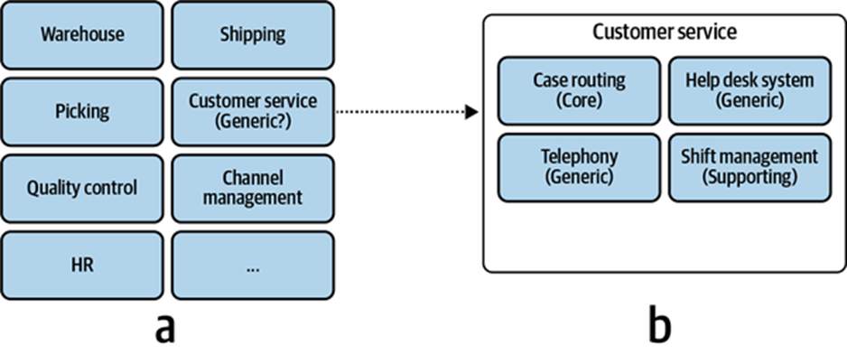
---

# Flow of Domain Knowledge

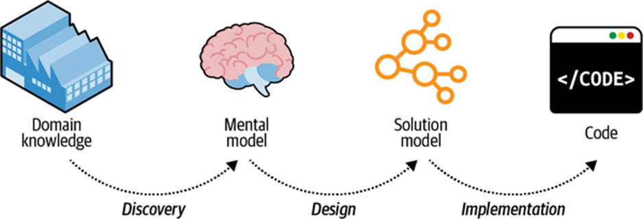
The classic SDLC transforms domain knowledge into software:

1. Domain understanding → **Analysis model**  
2. Analysis model → **Requirements**  
3. Requirements → **Design**  
4. Design → **Code**

---

# Ubiquitous Language

A shared language between developers + domain experts.

- Must remove ambiguity  
- Must reflect real business workflows  
- Should be documented in the project wiki  
- Gherkin is a great complementary tool  

A model must represent:
- business entities  
- behavior  
- cause-and-effect  
- invariants  

---

# What Is a Model?

A **model** is an abstraction representing business phenomena — focusing only on what matters.

---

# Bounded Context
Bounded contexts break the ubiquitous language into smaller, isolated models.

### Key Characteristics
- A ubiquitous language **only applies inside its bounded context**
- Bounded contexts evolve independently  
- They also define **physical boundaries** (service, module, subsystem)


### Subdomain vs Bounded Context  
- **Subdomain** = business classification  
- **Bounded Context** = implementation boundary  
- They can be 1:1, but not always.

---

# Bounded Context Relationships

## Mutual Dependency

### Partnership
Both contexts coordinate; a change in one must be communicated to the other.
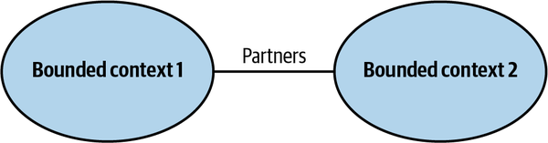
### Shared Kernel
Shared subset of the model used across multiple contexts.
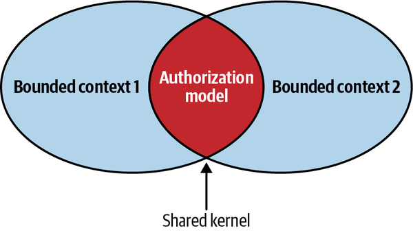
---

## Upstream / Downstream

### Conformist  
Downstream accepts upstream's model “as-is”.
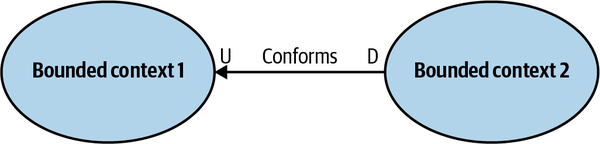
### Anti-Corruption Layer (ACL)  
Downstream protects itself via translation.

Use cases:
- Legacy integration  
- Upstream model volatility  
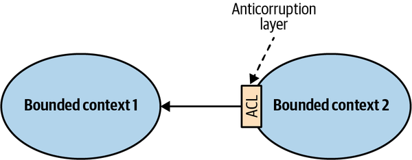
### Open Host Service  
Upstream exposes stable APIs for downstream.

---
# Analyzing the integration patterns between a system’s bounded contexts, we can plot them on a context map
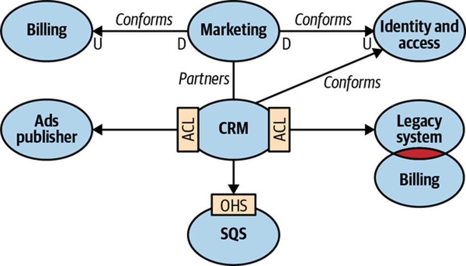
---

# Aggregate Root

Aggregates cluster entities + value objects and guarantee consistency.

Guidelines:
- Keep aggregates small  
- Expose **value objects**, not entities  
- One repository per aggregate  
- Inter-aggregate communication should be ID-based  


---
---

# Domain Model Pattern

The **Domain Model Pattern** is used when business logic is complex and cannot be handled through simple procedural scripts.  
It consists of three main building blocks:

## Value Objects  
Concepts in the domain identified **only by their values**, not identity.

Characteristics:
- Immutable  
- If one property changes → it becomes a new object  
- Holds both **data and behavior**  
  - e.g., `Money.add()`, `Distance.toKm()`

Value Objects help:
- Remove primitive obsession  
- Increase correctness  
- Make code more expressive  

---

## Aggregates  
A cluster of entities and value objects sharing the **same transactional boundary**.

Key properties:
- All modifications must happen through the **aggregate root**  
- Internal state is not mutated directly; only through **commands**  
- Aggregate state must be saved atomically as **one transaction**  
- Aggregates publish **domain events** to communicate important changes

Domain events allow other bounded contexts or components to react without tight coupling.

---

## Domain Services  
A stateless object hosting business logic that:
- **Does not naturally belong** to any entity or value object  
- Involves operations across multiple aggregates  
- Expresses domain behavior rather than infrastructure

Examples:
- Pricing rules involving multiple aggregates  
- Credit scoring using customer + financial history  

Domain services should model **pure business logic**, not infrastructure calls.

---

# Things to Look For While Refactoring
- Replace exceptions with Result pattern  
- Remove primitive obsession → use Value Objects  
- Replace null checks → Option/Maybe  
- Apply railway-oriented programming  

---

# Tactical Patterns

## Transaction Script  
Organizes business operations as **simple procedural scripts**.

Characteristics:
- Each operation is fully transactional  
- Works well for supporting or simple domains  
- Logic looks similar to ETL transformation  
- Minimal abstraction; easy to follow  

Use when:
- Business logic is **simple**  
- The domain does not justify aggregates or large models  


## Active Record  
A data structure that combines:
- Domain data  
- CRUD operations (insert, update, delete, find)

Good for:
- Simple business rules  
- CRUD-heavy systems  
- Systems where entities map closely to database tables  

Avoid when:
- Complex business logic is required  
- Invariants must be protected at all times  

## Entity
Has identity; must be mutable.

## Aggregate
Keeps related entities consistent.

## Event Sourcing  
Store every state change as events.

Benefits:
1. Full history  
2. Projections  
3. Concurrency control  

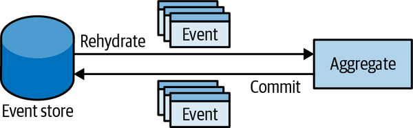

---
# Architectural Patterns


Business logic is the core of software — but software also needs:
- Input/output mechanisms (UI, APIs, CLI, message consumers)
- Persistence (databases, caches, storage)
- Integration with external systems

Without clear boundaries, business logic can become scattered across UI, database, or infrastructure, making changes expensive and risky.  
Architectural patterns provide **organizational structure** to keep concerns separated.

This chapter covers the three major patterns:
- **Layered Architecture**
- **Ports & Adapters (Hexagonal, Clean, Onion)**
- **CQRS**

---

## Layered Architecture

Layered architecture organizes the system into **horizontal layers**, each responsible for one technical concern.

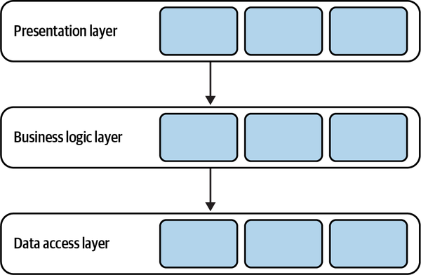

Typical layers:
1. **Presentation Layer (UI / Controllers / API / CLI / Message listeners)**  
2. **Business Logic Layer (Domain Logic, Use Cases)**  
3. **Data Access Layer (DB queries, repositories, integration clients)**  

Modern systems treat the presentation layer broadly, including:
- GUIs  
- APIs  
- CLI apps  
- Event subscribers  
- Outgoing message producers  

### Business Logic Layer
This layer implements the program’s business rules — the “heart of software”.  
It hosts:
- Domain Model  
- Transaction Script  
- Active Record  
- Aggregates & Value Objects  

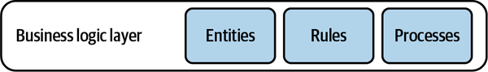
### Data Access Layer
Responsible for interaction with:
- Relational databases  
- Document stores  
- Key-value stores  
- Search engines  
- Cloud object storage  
- External APIs  

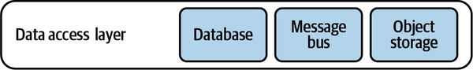
### Communication Between Layers
Layers communicate **top-down only**:
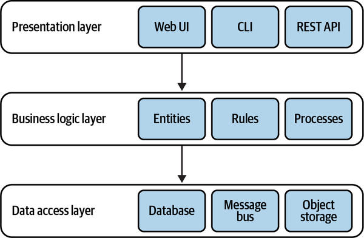

This prevents UI or infrastructure decisions from leaking into business logic.

---

## Variation: Adding a Service Layer (Application Layer)

Many layered systems add a **Service Layer** as a facade between Presentation and Business Logic:

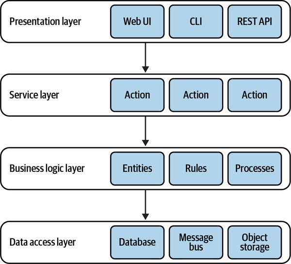

The service layer:
- Exposes system operations (use cases)
- Coordinates domain objects
- Handles transactions
- Decouples UI from domain implementation

Example responsibilities moved from a controller → service:
- Starting/committing/rolling back transactions  
- Orchestrating domain objects  
- Returning standardized results  

Benefits:
- Reuse across multiple UIs (web, API, CLI)
- More modular, more testable
- Clear boundary between UI and domain

The service layer is **logical**, not a microservice.

### When to Use Layered Architecture
Good fit when:
- Business logic uses **Transaction Script**  
- Business logic uses **Active Record**  
- The domain complexity is moderate  
- Infrastructure + domain coupling is acceptable  

Not ideal for:
- Rich Domain Model  
- Event Sourcing  
- Systems requiring high decoupling  

### Layers vs Tiers
- **Layer** → logical separation inside an app  
- **Tier** → physical deployment boundary (server, container, service)

Layers ≠ microservices.

---

## Ports & Adapters (Hexagonal / Clean / Onion Architecture)

Layered architecture struggles when implementing a **domain model**, because domain code ends up depending on infrastructure.

Ports & Adapters reverses this:

### Key Principle: **Dependency Inversion**
Business logic should depend on **abstractions**, not technology.

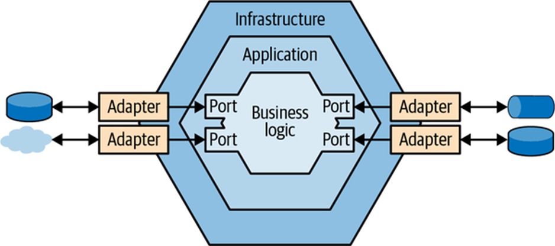

### Components:

#### 1. **Domain Layer (Core)**
- Aggregates  
- Value Objects  
- Domain Services  
- Domain Events  
- No external dependencies  

#### 2. **Application Layer (Use Cases / Service Layer)**
- Coordinates domain logic  
- Defines system operations  
- Orchestrates transactions  
- Calls domain and ports  
- Still has NO infrastructure dependencies  

#### 3. **Adapters (Infrastructure)**
Implement concrete technologies:
- Database adapters  
- Message bus adapters  
- REST clients  
- File storage adapters  

The Domain Layer defines **Ports** (interfaces), and Adapters implement them.

Example:

```csharp
public interface IMessaging {
    void Publish(Message msg);
    void Subscribe(Message type, Action handler);
}
````

Infrastructure implements:

```csharp
public class SQSBus : IMessaging { ... }
```

### Benefits:

* Full isolation of business logic
* Highly testable
* Technology decisions become replaceable
* Best fit for **Domain Model** and **Event Sourcing**

### When to Use:

* Complex business rules
* Systems needing longevity, testability, refactoring safety
* You want infrastructure to be plug-and-play
* You use aggregates, events, and value objects heavily

---

## CQRS (Command Query Responsibility Segregation)

CQRS extends Ports & Adapters with **separate models** for:

* Commands (writes)
* Queries (reads)

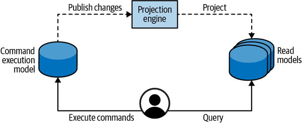
### Why CQRS?

* One model cannot serve all needs:
  OLTP vs OLAP, analytical vs transactional
* Polyglot persistence is often required
* Event-sourced systems cannot query aggregate state directly

### Two Categories of Models

#### **1. Command Execution Model (Write Model)**

* Validates invariants
* Performs business operations
* Only strongly consistent model
* Supports concurrency control

#### **2. Read Models (Projections)**

* Designed for optimal querying
* Precomputed/cached views
* Stored in any format (DB, flat files, search index)
* Can be rebuilt at any time

---

### Projecting Read Models

There are two projection methods:

#### **Synchronous Projection**

Use catch-up subscriptions to query updated records.

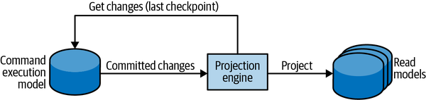
* Uses checkpoints
* Easy to rebuild projections
* Strong consistency for changes
* Recommended as the **baseline method**

---

#### **Asynchronous Projection**

Events published to a message bus update read models.

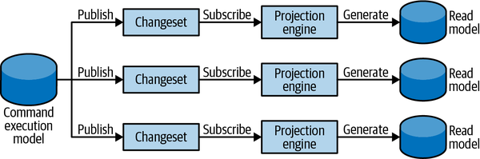
Pros:

* Scales well
* Low latency

Cons:

* Ordering issues
* Duplication
* Harder to rebuild read models

Recommendation:
**Use synchronous first, asynchronous optionally.**

---

### Misconception:

“Commands must never return data”

❌ Wrong
Commands **should** return:

* Success/failure
* Validation errors
* Updated values needed by UI

The only rule:
Returned data must come from the **strongly consistent command model**.

---

## When to Use CQRS

Use CQRS when:

* You have multiple representations of the same data
* You need multiple storage technologies
* You require fast, optimized queries
* You must support event sourcing
* You need decoupled, scalable reads

---

## Architecture Scope: Combining Patterns

One bounded context may contain multiple subdomains that require different business logic patterns:

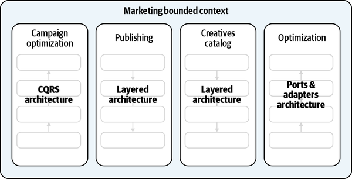
* Core subdomain → Domain Model + Ports & Adapters
* Supporting subdomain → Transaction Script + Layered Architecture
* Generic subdomain → Active Record

A monolith can still be **modular** when slicing subdomains logically.

---

# Summary of Architectural Patterns

| Pattern                  | Best For                                                            | Avoid When                                         |
| ------------------------ | ------------------------------------------------------------------- | -------------------------------------------------- |
| **Layered Architecture** | Simple or supporting domains, Active Record, Transaction Script     | Complex domain models                              |
| **Ports & Adapters**     | Rich domain models, event sourcing, long-term systems               | Very simple CRUD systems                           |
| **CQRS**                 | Need for multiple read models, polyglot persistence, event sourcing | Simple applications where a single model is enough |


# Tactical Design Decision Tree  
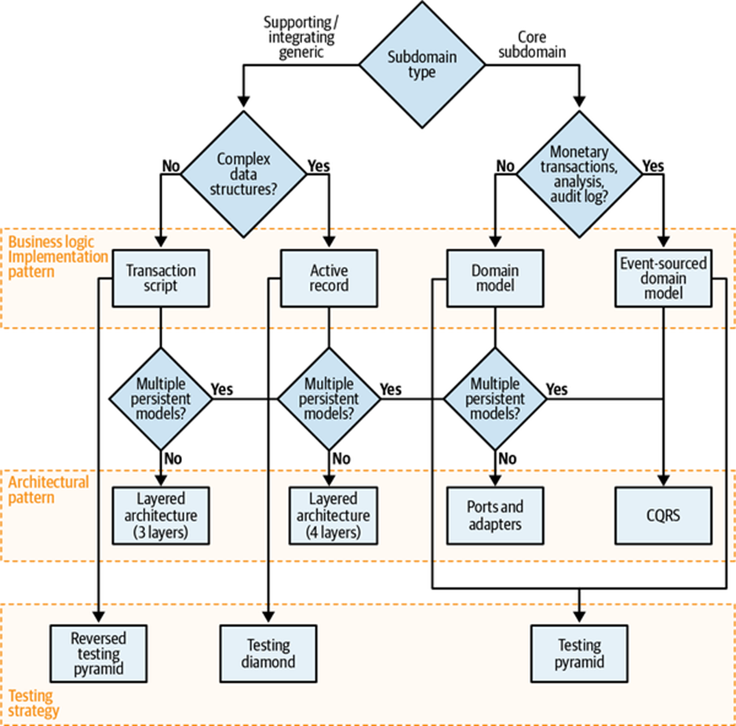
---

# EventStorming

EventStorming is a **collaborative, low-tech workshop** for rapidly exploring, visualizing, and understanding a business process.  
It is one of the most practical ways to build **ubiquitous language**, discover domain knowledge, identify bounded contexts, and model complex workflows.

EventStorming is not a software-design pattern.  
It is a **knowledge-discovery tool** that brings together all domain stakeholders.

---

## What Is EventStorming?

EventStorming explores a business process as a **timeline of domain events** (orange sticky notes).  
Participants brainstorm what happens in the business, step by step, and iteratively enrich the model with:

- Domain events  
- Commands  
- Actors  
- External systems  
- Read models  
- Aggregates  
- Bounded contexts  
- Pain points  
- Policies  

The final model becomes a shared understanding of the business process.

---

## Who Should Participate?

Anyone who holds knowledge about the business domain:

- Domain experts  
- Engineers  
- QA / Testers  
- Product managers  
- UI/UX designers  
- Operations / Support staff  

Diversity improves discovery.

⚠️ Optimal group size: **5–10 participants**.  
Too many people → less engagement.

---

## What Do You Need?

EventStorming is intentionally low-tech. You need:

- **Huge modeling space** (wall + butcher paper)  
  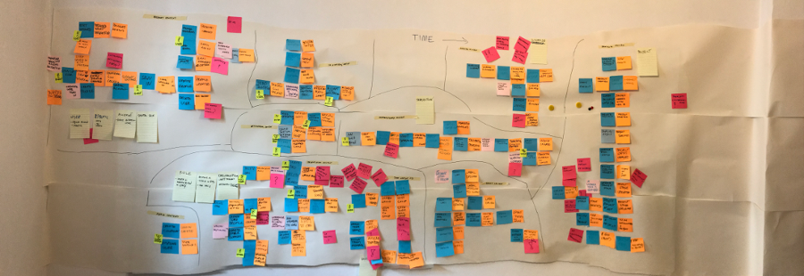
- **Lots of colored sticky notes**
- **Thick markers** (one per participant)
- **A large room** without tables (keeps participants moving)
- **Snacks** (the session lasts 2–4 hours)

---

# The EventStorming Process — 10 Steps

EventStorming is performed in ten iterative stages.  
Each stage enhances the model.

---

## **Step 1: Unstructured Exploration (Domain Events)**

Participants brainstorm domain events in **past tense**:

- *Order Submitted*
- *Payment Approved*
- *Inventory Reserved*

Everyone writes events on <span style="color: orange;">orange sticky notes</span> and posts them on the wall.

No order, no filtering—just discovery.
---

## **Step 2: Timelines**

Events are reorganized into chronological flows:

- Start with the **happy path**  
- Then add alternative paths, exceptions, failures  
- Draw arrows or branch the flow when needed  

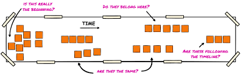

This step cleans duplicates and fills gaps.

---

## **Step 3: Pain Points**

Participants identify bottlenecks and issues:

- Manual steps  
- Missing domain knowledge  
- Ambiguous rules  
- Slow processes  

Pain points are shown on **pink diamond sticky notes**.

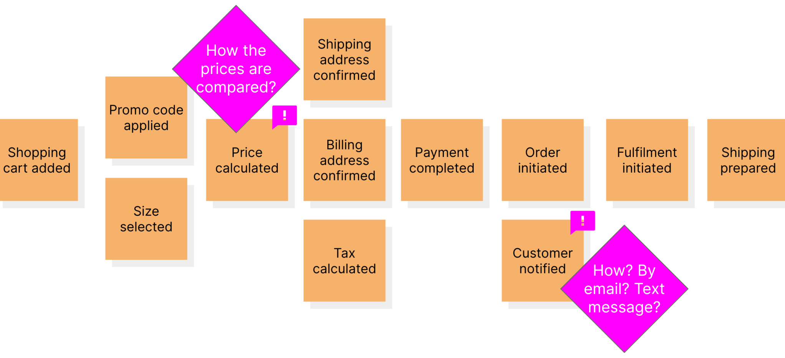
---

## **Step 4: Pivotal Events**

Pivotal events represent **phase changes** in the process:

Examples:
- *Shopping Cart Initialized*
- *Order Created*
- *Order Shipped*
- *Order Returned*

These often hint at **bounded context boundaries**.

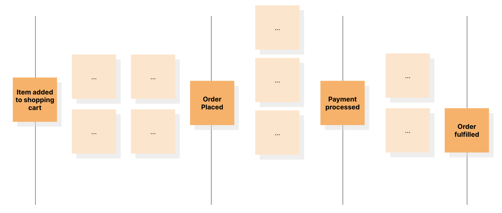
---

## **Step 5: Commands**

Commands represent intentions to change state.  
Written in **imperative tense**:

- *Submit Order*
- *Publish Campaign*
- *Rollback Transaction*

Commands use <span style="color: dodgerblue;">blue sticky notes</span> and are placed <strong>before</strong> the event they produce.

If a <strong>human actor</strong> initiates the command, add a <span style="color: goldenrod;">yellow sticky note</span> with the actor’s name.

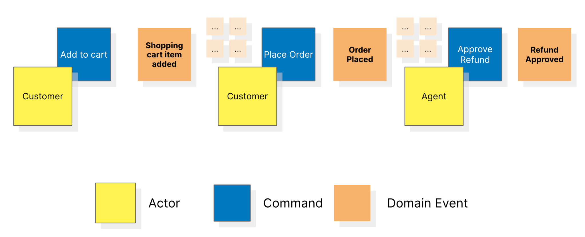
---

## **Step 6: Policies**

Policies describe automated reactions:

> *When event X happens → trigger command Y*

Used when no human actor initiates the command.  
Policies are <span style="color: purple;">purple sticky notes</span>, connecting events to commands.

Optional: Include decision logic.

Examples:
- *Notification*

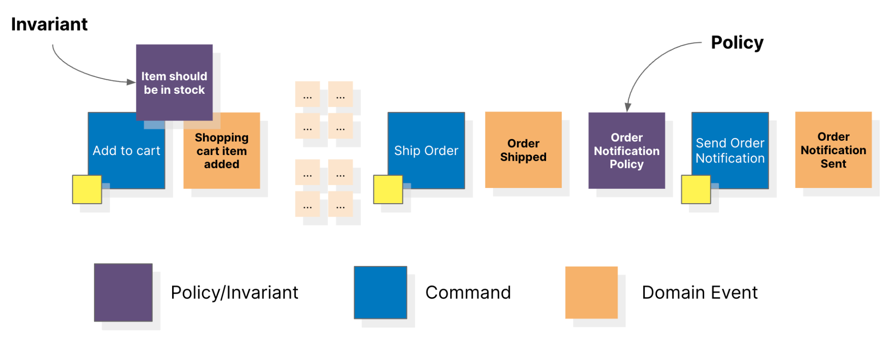
---

## **Step 7: Read Models**

A Read Model is the data needed by an actor to make a decision.

Examples:
- Shopping cart view  
- Notification list  
- Dashboard metrics  

Represented by <span style="color: green;">green sticky notes</span>, placed before commands.

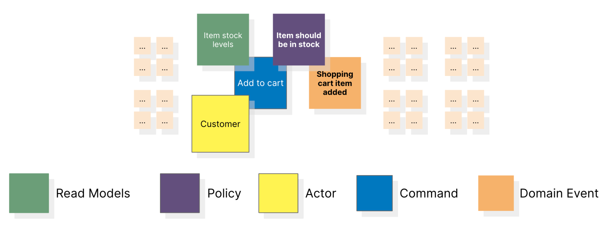
---

## **Step 8: External Systems**

Any system outside the domain:

- CRM  
- Payment gateway  
- Messaging service  
- Fraud detection  

External systems use <span style="color: hotpink;">pink sticky notes</span>.

They can:
- Trigger commands  
- Receive event notifications  

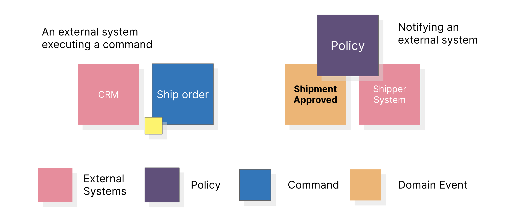
---

## **Step 9: Aggregates**

Group related commands + events into **Aggregates**.

Represented by **large yellow sticky notes**.

An aggregate:
- Receives commands  
- Applies invariants  
- Emits events  

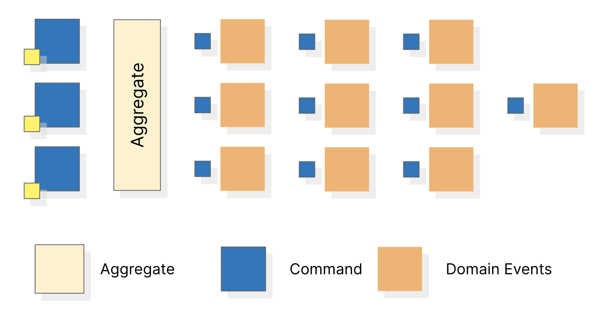
---

## **Step 10: Bounded Contexts**

Finally, group aggregates and flows into **Bounded Contexts** based on:

- Strong cohesion  
- Shared terminology  
- Policies linking aggregates  
- Natural functional grouping  

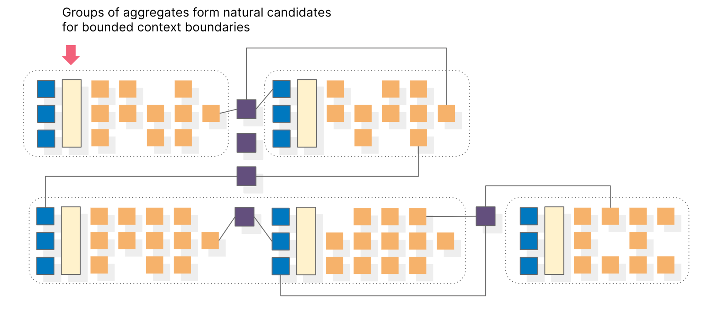
This step produces a map of the system’s logical architecture.

---

# Variants and Workshop Strategy

EventStorming is flexible — you don’t need to follow steps strictly.

Common strategies:

### **1. Big Picture EventStorming**
Use Steps 1–4  
→ To understand the domain and find bounded contexts.

### **2. Process Level EventStorming**
Use all 10 steps  
→ To deep-dive into a single business process.

### **3. Design-Level EventStorming**
For technical teams only, used to shape aggregates and domain model.

---

# What You Get After a Full EventStorming Session

- Domain events  
- Commands  
- Aggregates  
- Read models  
- Policies  
- External systems  
- Candidate bounded contexts  
- A shared domain understanding  
- Early ubiquitous language  
- A foundation for event-sourced models  

EventStorming is **not** a deliverable — the **value is the discovery**.

---

# When to Use EventStorming

Use EventStorming for:

✔ Building a ubiquitous language  
✔ Discovering domain knowledge  
✔ Exploring new business requirements  
✔ Understanding and improving existing processes  
✔ Recovering knowledge in legacy systems  
✔ Onboarding new team members  
✔ Identifying aggregates and bounded contexts  

### When NOT to Use It

✘ When the process is simple or trivial  
✘ When there is no domain complexity  
✘ When stakeholders are not available  

---

# Facilitation Tips

### Start with a Legend  
Show participants the sticky-note color code.

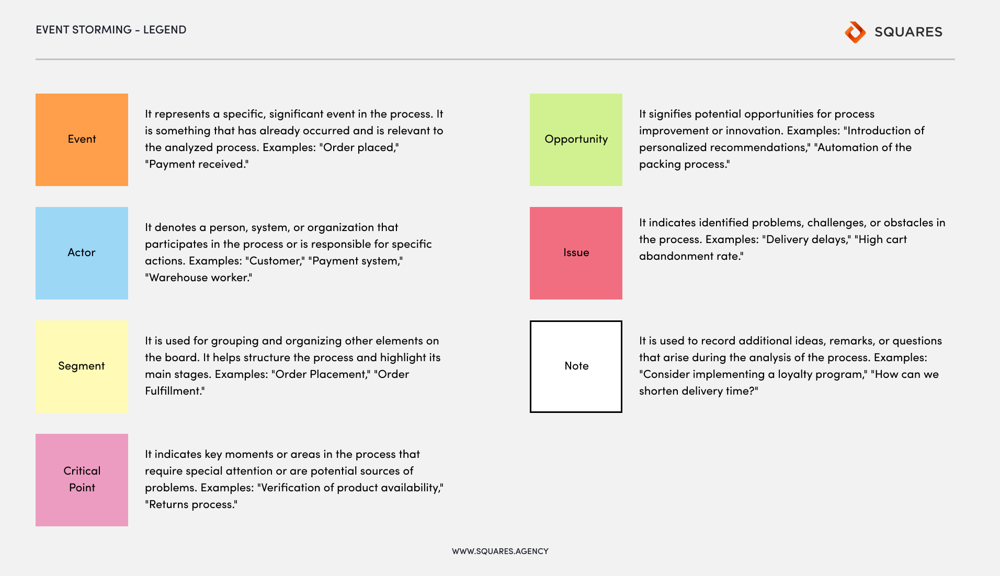
### Watch the Group Dynamics  
- Keep energy high  
- Get quieter people involved  
- Move to next step when momentum slows  
- Take breaks together  

### Remote EventStorming  
Tools like **Miro** help, but collaboration is weaker.  
Optimal remote group size: **≤5 people**.

---
# Understand the Business Domain  
Questions to identify the domain:
- What service does the company provide?  
- Who are the customers?  
- Who are the competitors?  

---

# Turn Logical Separation Into Physical  
If multiple teams work on the same domain → split into bounded contexts.

---

# Strangler Pattern

Gradually replace a legacy system with a new bounded context.
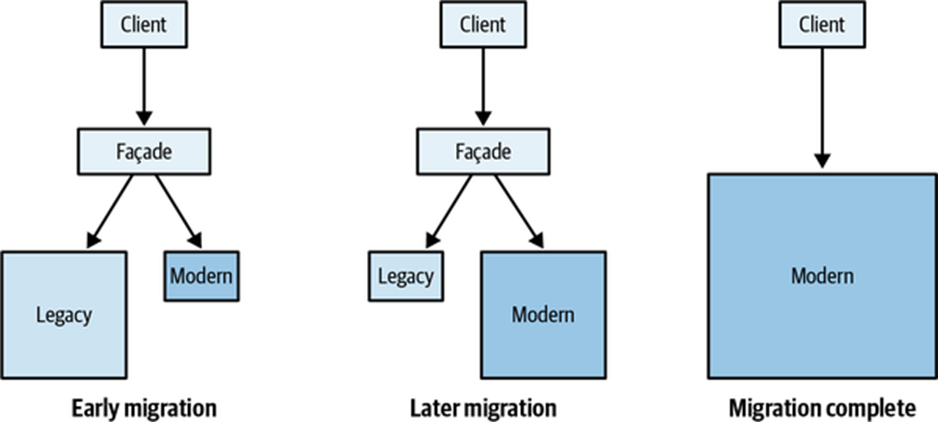
---

# Bounded Context and Microservice  
- All microservices are bounded contexts  
- But not all bounded contexts must be microservices  

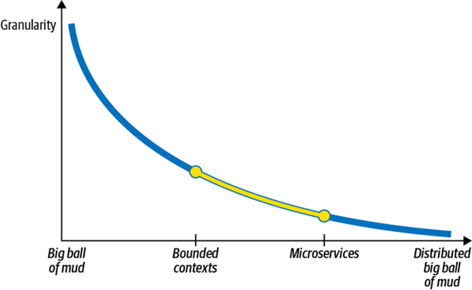
---
# Microservices, Complexity & Event-Driven Architecture

Modern microservices architecture is deeply connected to domain-driven design — but misunderstanding this connection has led many teams to create **distributed big balls of mud** instead of flexible systems.

This section focuses on the most critical concepts:

- **Local Complexity vs. Global Complexity**
- **Deep vs. Shallow Services**
- **How DDD boundaries guide microservice boundaries**
- **How event-driven architecture (EDA) complements microservices**
- **Types of events, their structure, and their proper use**

---

# What Is a Microservice?

A microservice is simply:

> **A service with a very small public interface (“micro front door”).**

A microservice:
- Exposes only a narrow set of operations  
- Owns its data  
- Encapsulates its internal complexity  
- Communicates through explicit interfaces  

This is why microservices **do not expose their databases** — doing so would create a massive, infinitely queryable interface.

---

# Why Naive Microservices Fail (Method-as-a-Service)

Splitting a service into one-method services may *reduce each unit’s local complexity*, but it drastically increases **system-wide complexity**:

- Interfaces grow to support cross-service coordination  
- Services must synchronize state  
- Data has to be replicated or stitched across calls  
- Integration logic spreads everywhere  

This results in:

> **A distributed big ball of mud.**

---

# Local Complexity vs. Global Complexity

Glenford J. Myers (Composite/Structured Design) distinguishes:

### **Local Complexity**
The complexity *inside* a service  
→ business logic, invariants, rules, operations  

### **Global Complexity**
The complexity of the *system as a whole*  
→ the number of integrations, dependencies, communication paths  

### The Trade-Off

| Focus | Outcome |
|-------|---------|
| **Only reduce local complexity** | Too many tiny services → global complexity skyrockets |
| **Only reduce global complexity** | One huge monolith → local complexity becomes unmanageable |


### The Goal:
> **Balance both local & global complexity.**  
> Create services that are not too small (shallow), not too large (monolithic), but **deep**.

---

# Deep vs. Shallow Services

Based on John Ousterhout’s *Philosophy of Software Design*:

A **deep module**:
- Has a **small interface** (narrow function)
- Hides a **large amount of internal logic**
- Reduces global complexity

A **shallow module**:
- Has a *small amount of internal logic*
- But requires a **large interface**  
  → forcing consumers to understand too much  

Shallow microservices = brittle, chatty, dependency-heavy systems.

Deep microservices = stable, scalable, evolvable systems.

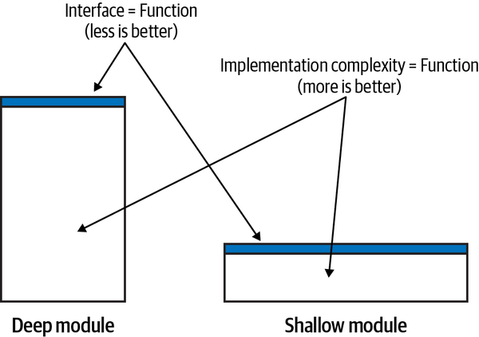
---

# Using DDD to Find the Right Microservice Boundaries

### 1. **Bounded Contexts**  
All microservices **are** bounded contexts.  
But not all bounded contexts **should** be microservices.

A bounded context:
- Ensures **linguistic & model consistency**
- Protects a **domain model**
- May contain multiple subdomains

BCs are the **widest valid boundaries**.  
Microservices are the **narrowest viable boundaries**.

### 2. **Aggregates**  
Aggregates are the **smallest** consistency boundary,  
and almost never should become separate microservices.

Splitting an aggregate across services leads to:
- Distributed transactions
- Inconsistent invariants
- Coupling through events
- High integration complexity

### 3. **Subdomains**  
Subdomains naturally define:
- Coherent business capabilities  
- A single conceptual purpose  
- A consistent set of use cases  
- Shared data & invariants  

This makes **subdomains the safest default boundary for microservices**.
---

# Compressing Microservice Interfaces with DDD Tools

Two DDD patterns reduce global complexity:

### **1. Open-Host Service**
Expose a *published language* designed for integration.  
Hide internal model complexity.

Result:
- Smaller interfaces
- Easier consumer adoption
- Controlled changes

### **2. Anti-Corruption Layer (ACL)**
Protects your domain model by translating foreign models.  
Can be implemented as a **standalone service**.

Result:
- Reduced local complexity in the consumer  
- Reduced global complexity overall  
- Cleaner domain models

---

# Event-Driven Architecture (EDA)

Microservices + Synchronous APIs often lead to:
- Tight coupling  
- Cascading failures  
- Slow systems  

EDA solves these by using asynchronous events:

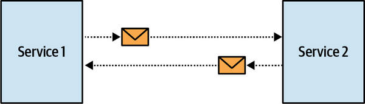
### EDA vs Event Sourcing  
| Event Sourcing | Event-Driven Architecture |
|----------------|---------------------------|
| Internal to a service | Between services |
| Events represent state transitions | Events represent notifications |
| Used as source of truth | Used for integration |

---

# Message Types in Event-Driven Architecture

EDA uses **messages**, of which **events** and **commands** are types.

### **Command**
→ "Do X" (may be rejected)

### **Event**
→ "X already happened" (cannot be rejected)

### Event Structure

```json
{
  "type": "delivery-confirmed",
  "event-id": "14101928-4d79-4da6-9486-dbc4837bc612",
  "correlation-id": "08011958-6066-4815-8dbe-dee6d9e5ebac",
  "delivery-id": "05011927-a328-4860-a106-737b2929db4e",
  "timestamp": 1615718833,
  "payload": {
      "confirmed-by": "17bc9223-bdd6-4382-954d-f1410fd286bd",
      "delivery-time": 1615701406
  }
}
```
# Event and Messages and Command

### Event  
Describes something that has already happened.

### Command  
Requests an operation — can be rejected.

---

# The Three Types of Events

## **1. Event Notification**

Minimal information.
Communicates *that* something happened.

Example:

```json
{
  "type": "paycheck-generated",
  "payload": {
      "employee-id": "456123",
      "link": "/paychecks/456123/2021/01"
  }
}
```

Use when:

* Consumers can query details
* Security matters
* Race conditions must be prevented

Benefits:

* Lowest global complexity
* Minimal coupling

---

## **2. Event-Carried State Transfer (ECST)**

Carries *all data needed* to reproduce part of the producer’s state.

Example (full snapshot):

```json
{
  "type": "customer-updated",
  "payload": {
      "first-name": "Carolyn",
      "status": "follow-up-set",
      "version": 7
  }
}
```

Consumers can:

* Maintain local caches
* Continue running when producer is down

Use for:

* Read-optimized systems
* Backend-for-frontend patterns
* Polyglot persistence

Trade-offs:

* Higher message volume
* Higher global complexity

---

## **3. Domain Events**

Represent significant *business events* modeled in the domain.

Example:

```json
{
  "type": "married",
  "payload": {
      "person-id": "01b9a761",
      "assumed-partner-last-name": true
  }
}
```

Characteristics:

* Rich semantic meaning
* Should not expose aggregate state
* May not be intended for external consumers
* Essential for event-sourced systems

⚠️ Mistake:
Using **every domain event** as an integration event leads to high global complexity.

---

# When to Use Which Event Type

| Purpose                               | Type                        | Why                  |
| ------------------------------------- | --------------------------- | -------------------- |
| Notify subscribers something happened | Notification                | Lowest coupling      |
| Share data for read models            | ECST                        | High autonomy        |
| Model business concepts               | Domain Event                | Pure domain modeling |
| Rebuild state                         | Domain Event                | Event sourcing       |
| Cache or replicate state              | ECST                        | Consumer-local data  |
| Trigger workflows                     | Notification / Domain Event | Depends on semantics |

---

# How DDD Reduces Complexity in EDA

EDA **can** turn your system into a distributed big ball of mud unless you use DDD boundaries:

* Bounded contexts → define message ownership
* Subdomains → shape integration flows , as each subdomain may contains >= Bounded Context
* Domain events → avoid leaking internal state
* ACL → prevent model corruption
* Open-host service → stable integration contracts

Good EDA systems:

* Use **notifications by default**
* Use **ECST only when necessary**
* Use **domain events for modeling**, not integration
* Keep **global complexity lower than local complexity**
---
# Events and Transactions

Several approaches:
- Outbox pattern  
- Saga (orchestration or choreography)  

---

# Data Mesh — Domain-Driven Analytical Modeling

Operational systems manage **real-time business transactions (OLTP)**.  
Analytical systems extract **insights (OLAP)** from accumulated data to optimize business outcomes, train ML models, or build BI dashboards.

Traditional analytical architectures (data warehouses & lakes) struggle at scale because they ignore **domain boundaries** and create **tight coupling** to operational schemas.

**Data Mesh** solves this by applying *DDD principles* to analytical data.

---

# OLTP vs OLAP Models

## OLTP (Operational Model)
- Represents **business entities**, lifecycles, invariants  
- Highly normalized  
- Optimized for **fast transactions**  
- Strict consistency requirements  

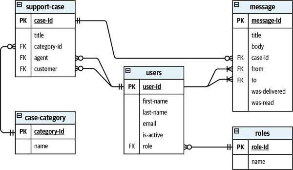
---

## OLAP (Analytical Model)
- Represents **business activities**, not entities  
- Uses **facts** (events that happened)  
- Uses **dimensions** (attributes describing facts)  
- Append-only  
- Optimized for **complex queries, aggregations, BI/ML**  

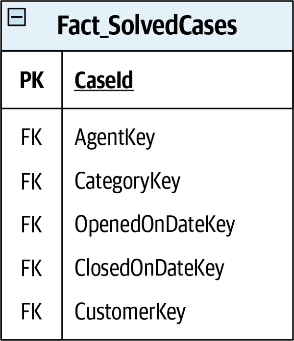
---

# Fact Tables

A **fact** represents something that happened (similar to domain events):

- Sale completed  
- Customer onboarded  
- Support ticket resolved  

Characteristics:
- Append-only  
- Often aggregated  
- Granularity depends on analytical needs  
- Time-dependent snapshots  

Example:

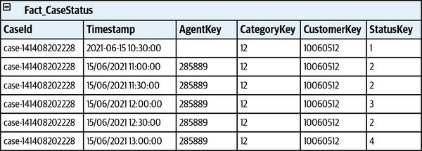
---

# Dimension Tables

Dimensions **describe** facts — the “adjectives”:

- Customer information  
- Product attributes  
- Time periods  
- Sales region  

Highly normalized to support flexible querying.

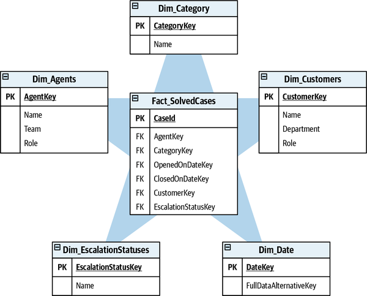

---

# Analytical Schemas  
Two common structures:

### ⭐ **Star Schema**
- Facts in the center  
- Dimensions directly linked  
- Easy to query, wide tables  

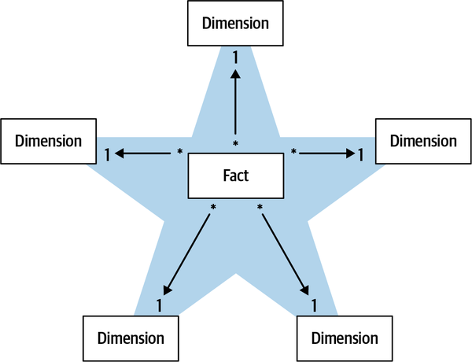
---

### ❄️ **Snowflake Schema**
- Dimensions are normalized further  
- Saves space  
- More JOINs → more compute  
---

# Traditional Analytical Architectures & Their Problems

## 1. Data Warehouse (ETL)
- Extract → Transform → Load  
- Centralized enterprise model  
- ETL tightly coupled to operational schemas  
- Breaks easily when domain models evolve  
- Requires massive coordination across teams  

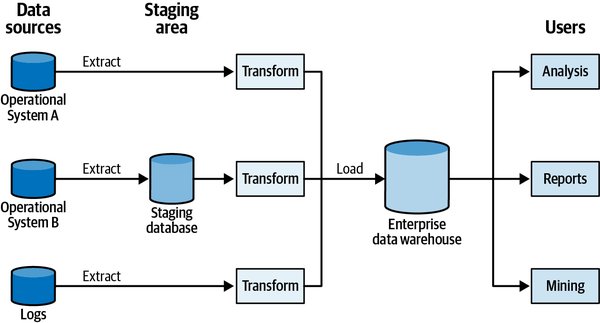
---

## 2. Data Lake
- Raw operational data stored as-is  
- Transformations happen later  
- Multiple models possible (good)  
- But data swamps emerge (bad):  
  - no schema  
  - low data quality  
  - multiple ETL versions  

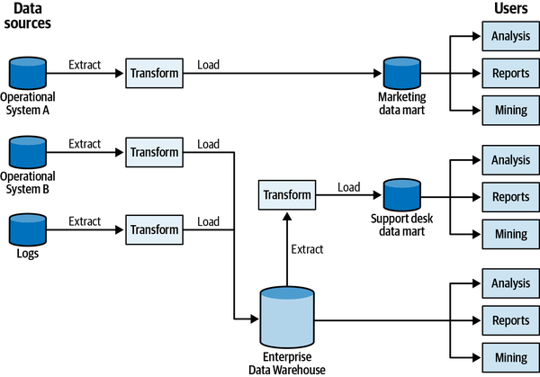
---

# Why Warehouses & Lakes Fail (DDD Perspective)

- Try to build a **single enterprise-wide model**, which DDD proves is impossible  
- Lack domain knowledge → bad analytics  
- ETL breaks whenever OLTP model changes  
- No ownership boundaries  
- Hard to evolve  
- Creates organizational friction between data teams & product teams  

These issues inspired a new approach: **Data Mesh**.

---

# Data Mesh — Analytical Architecture Based on DDD

Data Mesh applies DDD’s decomposition & autonomy to analytical data.

It is based on **four core principles**:

---

# 1️⃣ Decompose Data Around Domains

Each bounded context:
- Owns its **operational model (OLTP)**  
- Owns its **analytical model (OLAP)**  

Analytical models align with bounded context boundaries:

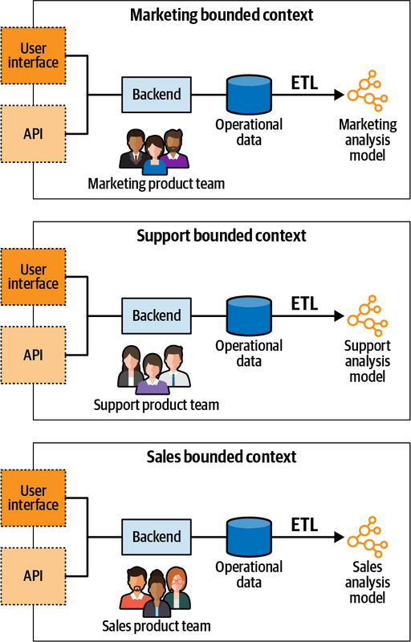
This solves:
- Ownership ambiguity  
- Coupling to operational schemas  
- Lack of domain understanding  

---

# 2️⃣ Data as a Product

Analytical data must be treated like a product with:

- Clear **public interfaces (output ports)**  
- Discoverability  
- Versioning  
- SLAs  
- Documentation  
- Polyglot access (SQL, Parquet, files, APIs, streams)

Each bounded context produces **analytical data products**.

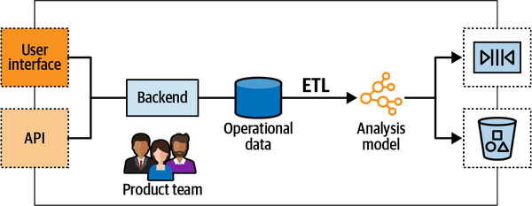
This means analysts no longer scrape internal databases; they **consume published analytical APIs**.

---

# 3️⃣ Enable Autonomy

Product teams should be able to:

- Produce their own data products  
- Consume others’ data products  
- Rely on a shared **data infrastructure platform**  

The platform team provides:

- Tooling  
- Storage  
- Access patterns  
- Data product templates  
- Governance  
- Monitoring  

---

# 4️⃣ Build an Ecosystem

A **federated governance group** ensures interoperability:

- BC data owners  
- Product owners  
- Platform team members  

Governance ensures:
- Naming consistency  
- Quality standards  
- Versioning rules  
- Data product compatibility  


---

# How DDD Supports Data Mesh

Data Mesh and DDD fit naturally:

###  Ubiquitous Language  
Improves analytical model clarity & correctness.

###  Bounded Contexts  
Define ownership of operational + analytical models.

###  CQRS  
Enables generating multiple analytical schemas from operational data.

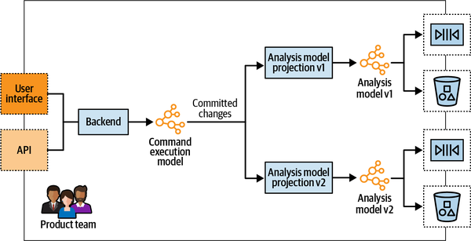
###  Open-Host Service  
Analytical schema becomes a *published language* for analytics.

###  Integration Patterns  
ACL, partnership, upstream/downstream also apply to analytical systems.

---

# Benefits of Data Mesh

- Scales with organization size  
- Aligns analytical modeling with domain boundaries  
- Decouples OLAP & OLTP evolution  
- Reduces ETL breakage  
- Enables trustworthy, high-quality analytics  
- Supports ML, BI, and real-time insights  
- Encourages self-service & autonomy  
